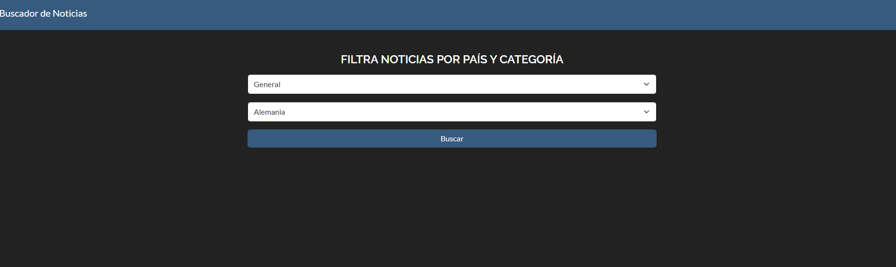
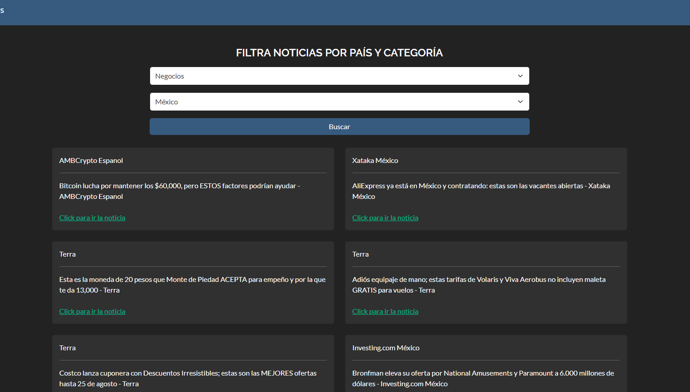
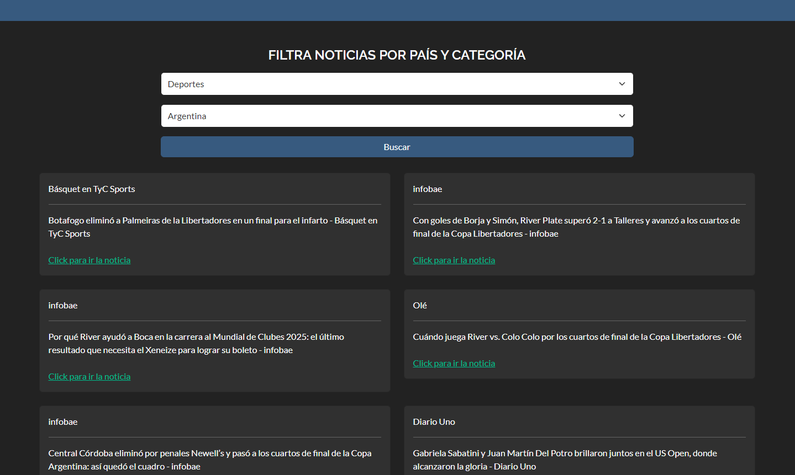

# App Búsqueda de Noticias

Selecciona un país y una categoría para recibr noticias de diferentes medios a través de una API.

## Stack Tecnológico

+ Bootstrap, JavaScript, TypeScript
+ Angular (18.0.5)

## Enlaces

Ver en Youtube: <a href="https://www.youtube.com/watch?v=REdZjF_TMBE" target="_blank">https://www.youtube.com/watch?v=REdZjF_TMBE</a>

## Imágenes de la App

## Perfiles

